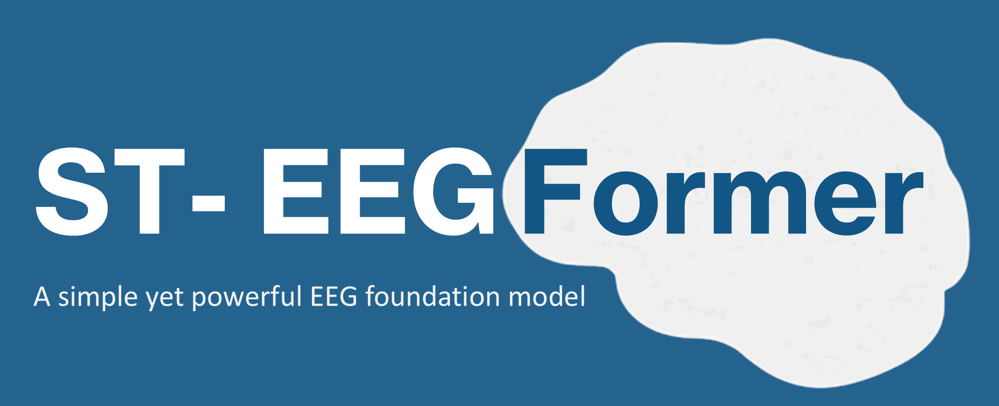
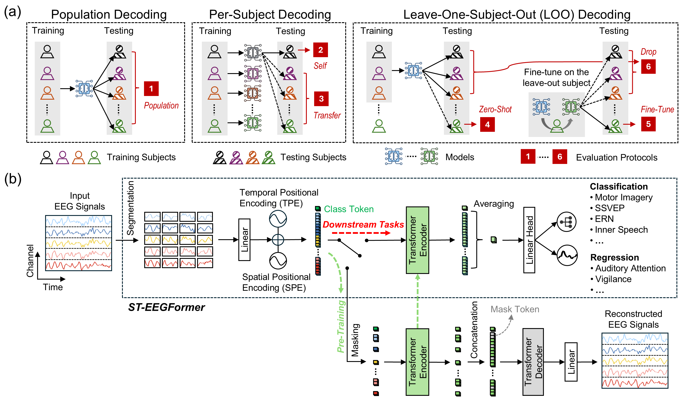
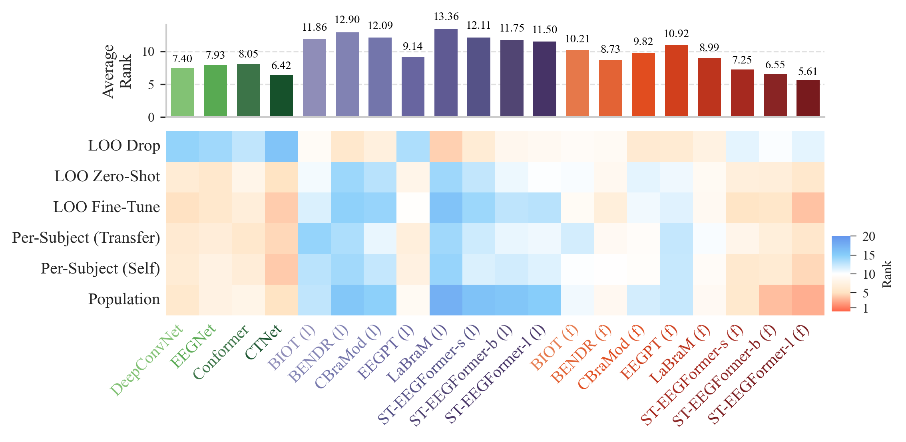

<p align="center">
  
</p>

<p align="center">
  <a href="https://eeg2025.github.io/leaderboard/"></a> <a href="https://openreview.net/forum?id=5Xwm8e6vbh"></a> <a href="https://github.com/LiuyinYang1101/STEEGFormer/releases"></a> 
</p>

**Official PyTorch implementation of the paper:**
> [**Are EEG Foundation Models Worth It? Comparative Evaluation with Traditional Decoders in Diverse BCI Tasks**](https://openreview.net/forum?id=5Xwm8e6vbh) (ICLR 2026)

<div align="center">
  <h3 style="color: #00407a;">
    Liuyin Yang, Qiang Sun, Ang Li, and Marc Van Hulle
  </h3>
  <p style="color: #116E8A;">
    <strong>Computational Neuroscience Group, KU Leuven</strong>
  </p>
</div>

## 🔥 News 🔥
* **[Jan 2026]** Our paper is **accepted to ICLR 2026**!
* **[Dec 2025]** 🥇 We won **1st Place** in Challenge 1 of the **NeurIPS 2025 EEG Foundation Challenge**!
* **[Jan 2025]** The original ST-EEGFormer paper was rejected from ICLR 2025

## Citation

If you use our model or find it useful, please cite the following paper:

```bibtex
@inproceedings{
yang2026_steegformer,
title={Are {EEG} Foundation Models Worth It? Comparative Evaluation with Traditional Decoders in Diverse {BCI} Tasks},
author={Liuyin Yang and Qiang Sun and Ang Li and Marc M. Van Hulle},
booktitle={The Fourteenth International Conference on Learning Representations},
year={2026},
url={https://openreview.net/forum?id=5Xwm8e6vbh}
}
```

### 1. Methodology
Our framework provides a transparent and rigorous benchmark for EEG foundation models by evaluating them across 6 distinct decoding protocols, ranging from simple population decoding to challenging zero-shot and transfer learning scenarios.

<p align="center">
  
</p>

As a baseline for this benchmark, we introduce ST-EEGFormer: a minimal, ViT-based foundation model. To ensure transparency and ease of reproduction, the model is pre-trained purely through Masked Autoencoder (MAE) reconstruction on raw EEG signals.

### 2. Benchmark Results
Our comprehensive evaluation reveals that while classic neural network decoders remain highly competitive, EEG foundation models often struggle when restricted to linear probing. However, when fully fine-tuned, ST-EEGFormer-large—achieves the best average rank (5.61) among all compared models, despite its large parameter count (>300M).

<p align="center">
  
</p>

## License

This project is licensed under the **MIT License** - see the [LICENSE](LICENSE) file for details. 

> **Note:** The MIT license applies to the **source code** provided in this repository. The associated research paper, architectural diagrams, and the name "ST-EEGFormer" are © 2026 Computational Neuroscience Group, KU Leuven. All rights reserved.

---

## 3. Environment

The models are implemented in **PyTorch** and can be used in standard Python environments.

> **Python version used for pre-training:** `3.11.5`

| Category | Package | Version | Note |
| :--- | :--- | :---: | :--- |
| **Core** | `torch` | 2.4.1 | Deep learning framework |
| **Core** | `timm` | 1.0.10 | Transformer model implementations |
| **Extra** | `wandb` | 0.22.2 | Experiment logging & monitoring |
| **Extra** | `mat73` | 0.65 | Loading MATLAB v7.3 files |
| **Extra** | `scikit-learn` | 1.3.2 | Evaluation metrics and utilities |

### 3.1 Classic EEG Model Dependencies
If you want to run the training code for **classic EEG models**, you will also need:

#### For all downstream tasks except SSVEP
| Package | Version | Note |
| :--- | :---: | :--- |
| `scipy` | 1.16.0 | General scientific computing utilities |
| `numpy` | 1.25.2 | Core numerical computing library |
| `mne` | 1.9.0 | EEG preprocessing and data handling |
| `pyriemann` | 0.6 | Riemannian geometry-based EEG classification |
| `scikit-learn` | 1.4.2 | Machine learning toolkit |
| `lightgbm` | 4.6.0 | Gradient boosting models for tabular features |

---

#### Specifically for SSVEP task as meegkit toolbox has compatibility issue with others
| Package | Version | Note |
| :--- | :---: | :--- |
| `scipy` | 1.15.3 | General scientific computing utilities |
| `numpy` | 2.2.6 | Core numerical computing library |
| `mne` | 1.9.0 | EEG preprocessing and data handling |
| `scikit-learn` | 1.7.0 | Machine learning toolkit |
| `meegkit` | 0.1.9 | EEG/MEG signal processing utilities |

---

## 4. Model Specs

**ST-EEGFormer** is designed for **128 Hz EEG data**.

- Pre-trained to reconstruct **6-second EEG segments**  
- Supports up to **142 EEG channels**  
- Recommended input: **≤ 6-second segments**, sampled at **128 Hz**

The list of available/pretrained channels can be found in:

```text
pretrain/senloc_file
```

## 5. Quick Start

A Jupyter notebook containing a minimal tutorial on how to use the model can be found in:

```text
easy_start/simple_example.ipynb
```

## 6. Reproducibility

If you want to pre-train a model, use the script:

```text
pretrain/ddp_train_eeg.py
```

You will need to prepare your own custom dataset that provides EEG segments and the corresponding channel indices.

If you want to run benchmark experiments on downstream BCI tasks using neural networks, use:

```text
benchmark/neural_networks/wandb_downstream_evaluation.py
```

For dataset preparation and configuration details, please refer to the README file in:

```text
benchmark/neural_networks
```

For the EEG 2025 Foundation Challenge, the code is located in:

```text
eeg_foundation_2025
```

where the models are slightly modified (they include additional channel embeddings for the HBN dataset).

---

## 7. Pre-trained Models

We release small, base, and large ST-EEGFormer models in the GitHub releases.

[ST-EEGFormer-small release](https://github.com/LiuyinYang1101/STEEGFormer/releases/tag/ST-EEGFormer-small).

[ST-EEGFormer-base release](https://github.com/LiuyinYang1101/STEEGFormer/releases/tag/ST-EEGFormer-base).

[ST-EEGFormer-large release](https://github.com/LiuyinYang1101/STEEGFormer/releases/tag/ST-EEGFormer-large).

Additionally, we provide large-ST-EEGFormerV2, which has undergone further pre-training on the HBN datasets for the EEG 2025 Foundation Challenge.

[ST-EEGFormer-large release-HBN](https://github.com/LiuyinYang1101/STEEGFormer/releases/tag/ST-EEGFormer-largeV2).

---

## 8. Coming Soon 🚀

We are now working on the following updates:

* **Dataset Preprocessing Codes**: Standardized scripts for cleaning and formatting benchmarked datasets.
* **Step-by-Step Tutorials**: More Jupyter notebooks demonstrating how to use the model.